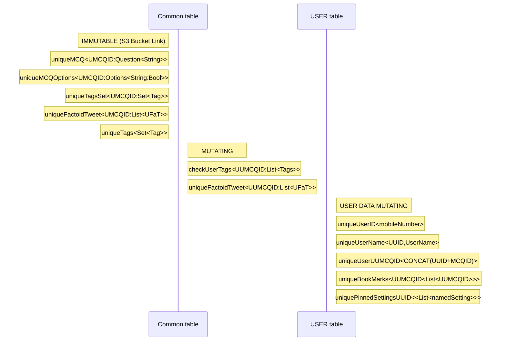

# BCBR

## Basic Course in Biomedical Research 
* Its is a Mandatory course conducted by IIT madras, for MD/MS students and faculty.
* It is conducted in Cycles. Questions, answers and chapters are improved every cycle.  
* It covers topics which are essential process and concepts of medical research.
* BCBCR Ongoing Cycle  : [BCBCR 5th Cycle](https://onlinecourses.nptel.ac.in/noc21_md05/preview)

# Apps
[BCBR Q Bank](https://github.com/fdrepo/flutterdoctor.com/blob/0ae8871898c3ac858bf4b86bc87185797398ae48/docs/BCBR/BCBR_Q_Bank.md)

# CloudDB Design

# M-MV Design

[<< go back to F.d. home](README.md)
