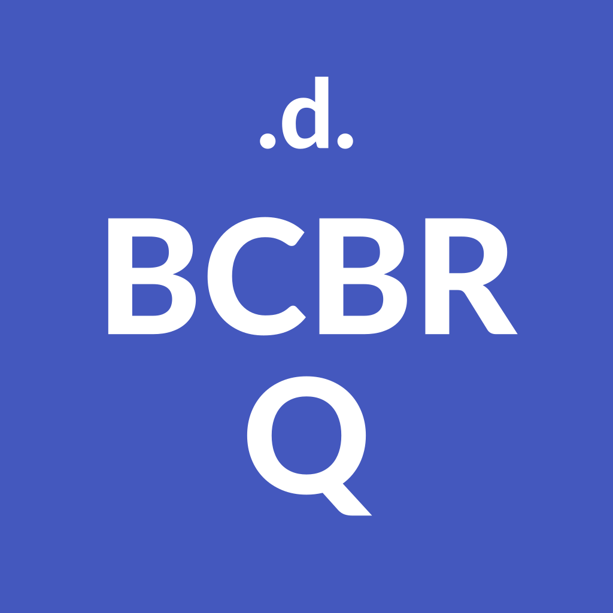
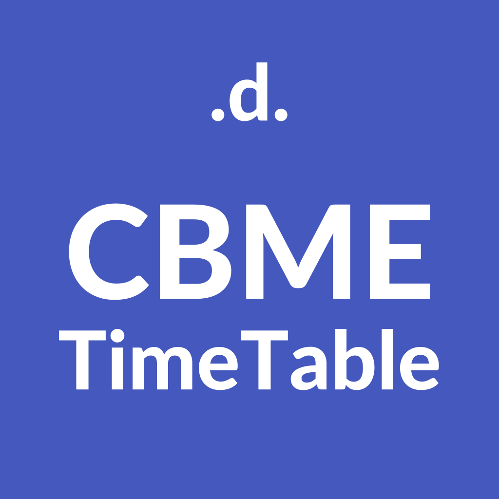
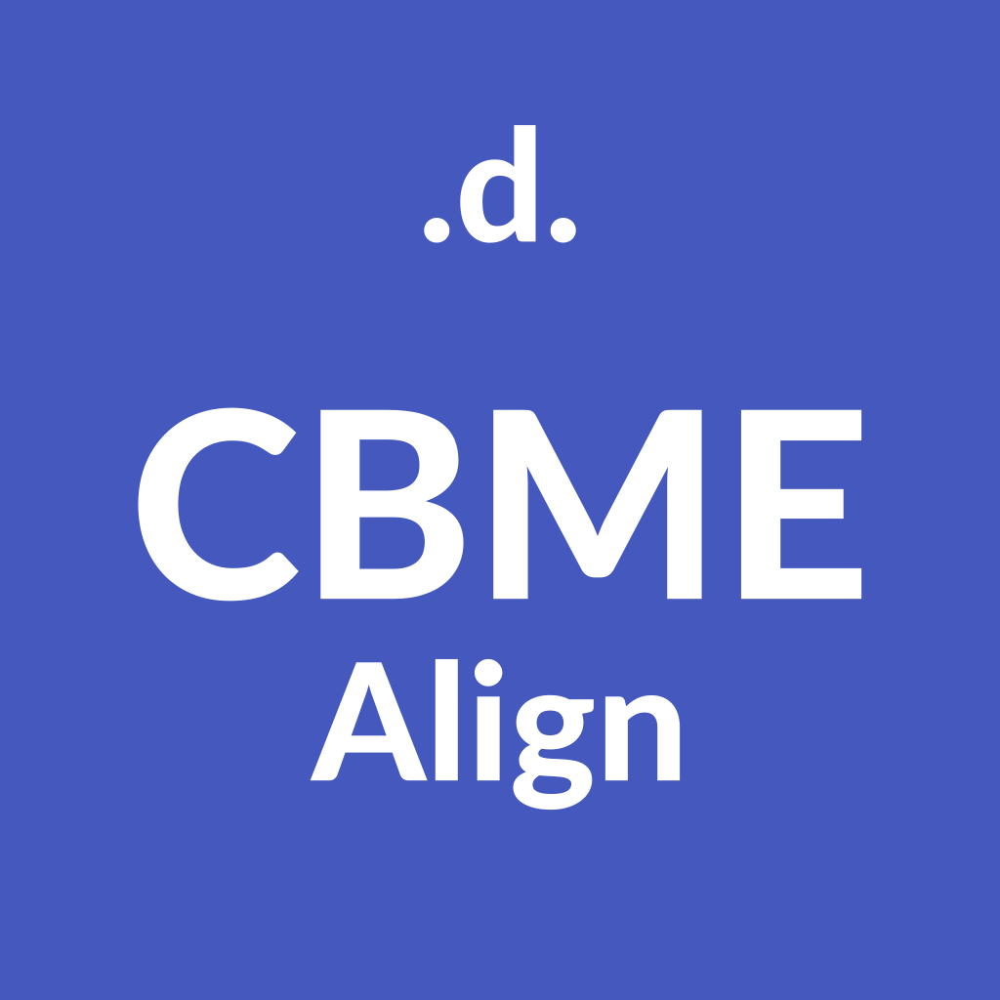

# 

---
# 
Our Projects
---

### [BCBR App & Book]()
- Question Bank App: MCQ Questions bank app on "Basic Course in BioMedical Research".
- [Download](https://play.google.com/store/apps/details?id=com.flutterdoctor.fd_bcbr): From [Android "Play Store"](https://play.google.com/store/apps/details?id=com.flutterdoctor.fd_bcbr) 
- [Download](): [Apple "App Store"](). "90%" 
- [Get Book](): Download "BCBR Brief" by flutterdoctor from [Amazon Book Store](). "60%" 
---

### [CBME TimeTable App]()
- Project On Works "10%" 
- [For Students](): To View "CBME Align" edited timetable.
- [Download](): From [Android "Play Store"]() and [Apple "App Store"]().  
---

### [CBME Align App]()
- Project Yet to Start "0%" 
- [For Teachers](): To Align and Edit Competencies. 
- [Align Subjects](): Helps map one subjects to another subject.
- [Sort Subjects](): Fit already aligned subjects to timetable.
- [Online App](): Only Online for ease of Colloboration.
 
---
# 
About Us
### Vision, mission, target & motivation 
* [Vision](): Equality in education for all privileged or unprivileged by service.
* [Mission](): Open-source application which will run on Android and iOS. 
* [Target audience](): Students, teachers, and researchers with clinical orientation. 
* [Motivation](): Building scientific acumen in medical students, teachers and researchers. And to have critical evaluation skills, which will accelarate change in medical system. 

### 4 pillars of existence
* [Developers](): those who makes it a reality, all source-codes will be open-sourced in GitHub  
* [Doctors](): those who makes it useful, the content will be accessible by all users of app for free. 
* [Educators](): those who makes it engaging and sustainable, you are controllers of change.
* [Students](): those who can give feedback, you are the constant change. 

### Design Principles 
* Minimalism with Collaboration. 
* Domain and Test Driven.
* Immutable and Functional.
* Optimal Cognitive Load and Constructivism.

---
# 
Sponsors

